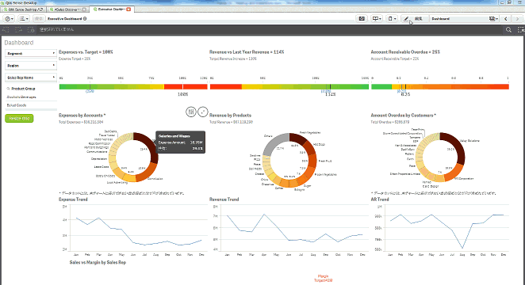

Screen Resizer for Qlik Sense

The **Screen Resizer for Qlik Sense** is an extension which allows you to change the screen height and grid size.

## Demo

## Install
1. Qlik Sense Desktop
Unzip the downloaded zip file into "C:\Users\%USERNAME%\Documents\Qlik\Sense\Extensions\" folder.

2. Qlik Sense Server
Please refer to the following instruction for importing an extension:

	[Import Extension]( http://help.qlik.com/sense/en-US/online/#../Subsystems/ManagementConsole/Content/QMC_Resources_Extensions_AddingExtensions.htm?Highlight=add extension "Import Extension")

Remove "images", "preview.png" and "README.md" before importing the extension.

## Usage
1. Open a Qlik Sense App.
2. Drag and drop the "Screen Resizer" extention onto the canvas.
3. On the extension property, nagivate to Settings>Properties and change the "Screen Height (%)". The change of the screen size is applied immediately by pressing the ENTER key.
4. To change the grid size, change the "Number of Rows" and "Number of Columns".
5. Press "Resize Grid" botton on the extension placed on the canvas. This would apply the change of the grid size. 
6. Nagivate to Settings>Style and swith off "Show 'Resize Grid' Botton". This option hides the botton on the extension and shows the text entered in "Text(Displayed when the button is hidden)" box. You can use this option to keep the consistency of the sheet design.

## Known Limitations
- Resizing the charts objects to fit them to the screen size might not work when the Screen Resizer extension is placed on other place than the top of the sheet. 
- When you navigate from a sheet with Screen Resizer extension to other sheets in an app using the sheet navigator or back/forward button on the toolbar, the screen height set on the Screen Resizer extension is also applied to other sheets. The workaround is to place the Screen Resizer extension on other sheets with 100% height setting.

## Licence
The software is provided "AS IS" without warranty of any kind. This project is licensed under the terms of the MIT license.

## Author
Masaki Hamano

The codes of resizing grid is based on (https://github.com/ludberg/xGridResizer "xGridResizer@ludberg").
